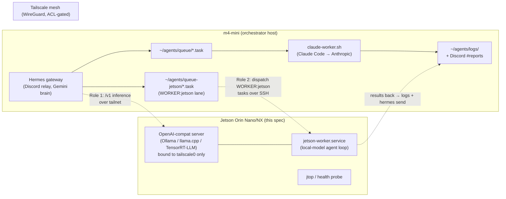

> Preserved 2026-09-04 from `ezybg7/pantry` PR #101 (closed 2026-08-22 because orchestrator/infra tooling lives in ~/agents, not the pantry repo — commit 94f6731, `specs/jetson-orin-nano-setup.md`). Unbuilt plan; the 2026-09-04 runbook builds on it.

# Jetson Orin Nano — local AI worker/inference node for Hermes

_Status: draft for review (2026-08-19). Owner: infra. **Not a product feature** — no schema, no app/client surface. This spec lives in the pantry repo because that is where this project's infra/ops specs live (alongside `nightly-sync.md`, `hosted-supabase.md`); the node it describes belongs to the **Hermes orchestrator** on the m4-mini, not to the Ambry app._

> **Provisioning gate.** Everything here is a *plan*. Nothing is built and nothing is bought. The hardware (a Jetson Orin Nano/NX dev kit, PSU, NVMe, cooling) is a purchase decision for Everett — see [Open questions](#open-questions-for-everett-decide-in-the-pr). Flashing versions and NVIDIA tooling move fast; treat every pinned version below as "the latest GA of this major line, verified against developer.nvidia.com at flash time," not a guarantee.

## Purpose & motivation

The Hermes gateway on the m4-mini is a **relay + delegate orchestrator**: it fronts Discord and routes real work to Claude Code through a file-based task queue (`~/agents/queue/*.task` → the `com.user.claude-worker` launchd watcher → `claude-worker.sh` → `claude -p`). Its own conversational brain is currently **Gemini `gemini-flash-lite-latest`** over the OpenAI-compatible endpoint, after the local Ollama `qwen3-agent-128k` backend was retired following a hallucinated-action incident (the model is still on disk for a potential retry).

That deployment has two standing frictions this node addresses:

1. **The Gemini backend is rate-limited and its key is shared.** Free tier is **5 requests/min, 20 requests/day, and a 250,000-input-token/min aggregate per model** — and the same key is shared with app-side AI, so the daily/token caps burn fast (documented at length in the `hermes-local-gateway-ops` skill). Every offloadable call — title generation, summarization, classification, memory-reflection passes, embeddings — that can run on hardware we own is a call that never touches that quota.
2. **The only local-inference option was on-box and CPU-bound.** The retired qwen backend ran on the m4-mini itself, competing with the gateway and the Claude worker for the same cores. A dedicated always-on GPU node moves that workload **off** the mini entirely.

A Jetson Orin Nano is a small, cheap, low-power (7–25 W), always-on CUDA box. Putting one on the tailnet gives Hermes a **dedicated local inference node** it can call over an encrypted mesh, and — as a scoped extension — a **local-model worker** for the class of delegated tasks that don't need a frontier model.

This is deliberately **not** an attempt to replace the Claude Code worker. That worker runs Anthropic's frontier models (Fable/Opus) against the Max plan for multi-file implementation, and an 8 GB edge device cannot and should not pretend to do that job. The Jetson's remit is the *cheap, private, high-volume, latency-tolerant* tail of the workload.

## Goals & non-goals

**Goals**

- A hardened, always-on Jetson node exposing an **OpenAI-compatible inference API** (`/v1/chat/completions`, `/v1/embeddings`, `/v1/models`) reachable **only over Tailscale** from the m4-mini.
- **Role 1 (primary): inference node.** Hermes and other tailnet consumers call it for local chat/summarization/classification/embedding work, offloading the Gemini free-tier caps and reviving the retired local-model capability off-box.
- **Role 2 (extension): local-model queue worker.** A scoped analog of `claude-worker.sh` that drains a dedicated queue lane of `WORKER:jetson`-tagged tasks — the tasks a ~3–8B model can do well.
- A repeatable, versioned **setup + operational runbook** (flash → harden → containerize → serve → wire → monitor) so the node can be rebuilt from scratch deterministically.
- **Security parity or better** with the mini: key-only SSH (explicitly *not* repeating the mini's still-open "SSH password authentication is ENABLED" audit finding), default-deny firewall, inference bound to the tailnet interface only.

**Non-goals**

- **Not** a replacement for the Claude Code worker or its frontier models. Local models here are for latency-tolerant, non-frontier work only.
- **Not** the Hermes *primary relay brain* on day one. Hermes enforces a **≥64K model context floor** at agent-init (the documented `ValueError … below the minimum 64,000 required`), and an 8 GB Nano cannot hold a 7–8B model's weights *and* a 64K KV cache. Promoting the Jetson to primary/fallback relay backend is a later, gated step (see Role 1) — and the qwen-retirement history says a small local model must **earn** the autonomous relay role through the scripted verification rounds, not be handed it.
- **Not** a reopening of the **local-vision-for-receipts** decision. That exploration (former pantry spec 20) was **closed 2026-07-20** in favor of managed cloud (Claude Haiku 4.5) on accuracy-on-thermal-receipts and zero-ops grounds. Having dedicated GPU hardware *changes the cost side* of that calculus, so it's listed as an [open question](#open-questions-for-everett-decide-in-the-pr) for Everett to *reconsider* — this spec does not revert the decision.
- **Not** a public-facing service. Nothing here is exposed to the LAN or the internet.

## Hardware target

The task names "Orin Nano (8 GB/16 GB)." One clarification up front, because it drives the model-sizing math:

| Board | RAM (unified LPDDR5) | GPU | INT8 TOPS | Mem BW | Power | Fits the "relay brain" (≥64K) role? |
|---|---|---|---|---|---|---|
| **Orin Nano 8 GB** (dev kit) | 8 GB | 1024-core Ampere + 32 tensor | 40 (67 in *Super* mode) | ~68 GB/s (~102 in Super) | 7–25 W | **No** — aux/worker only |
| Orin Nano 4 GB | 4 GB | 1024-core Ampere | 20–34 | ~34–51 GB/s | 7–15 W | No — too small for useful LLMs |
| **Orin NX 16 GB** | 16 GB | 1024-core Ampere + 32 tensor + 2 DLA | up to ~100 | ~102 GB/s | 10–25 W | **Plausibly** — see Role 1 |

Notes:

- The **"16 GB" part is an Orin NX**, not an Orin Nano (the Nano tops out at 8 GB). Same SODIMM form factor and carrier, so the dev kit can host either module. If the relay-brain role in Role 1 is wanted, buy the **NX 16 GB**; if the node is purely aux-inference + scoped worker, the **Nano 8 GB** (ideally the *Super*-capable revision) is enough and cheaper. This is the single biggest hardware decision — surfaced as an open question.
- **Memory bandwidth, not TOPS, is the LLM decode ceiling.** Token generation is memory-bound: throughput ≈ bandwidth ÷ active bytes/token. The TOPS figures matter for vision/prefill, not steady-state chat.
- **Unified memory is shared with the OS.** Budget ~1.5–2 GB for L4T + services; the rest is the model + KV + runtime arena.
- **Storage: NVMe, not microSD.** The dev kit has an M.2 Key-M slot — put the rootfs (or at least the model store and swap) on NVMe. A microSD card is too slow for model loads and wears out under 24/7 writes.
- **Power is a real failure mode.** Use a quality supply that can hold the board's peak (USB-C PD ≥ 5 A / a ≥ 25 W barrel supply per the module). Undervoltage shows up as throttling or spontaneous shutdown, not an obvious error — see [Failure modes](#failure-modes--triage).
- **Cooling: active.** The dev-kit heatsink+fan is fine, but a 24/7 inference node must keep the fan enabled and be watched for thermal throttling (`tegrastats`).

## Architecture overview



Two independent integration surfaces, either of which can ship alone:

- **Role 1 — inference node.** Pure request/response. Hermes (and any tailnet consumer) makes OpenAI-compatible HTTP calls to `http://jetson-orin:11434/v1`. No shared filesystem, no queue coupling. This is the low-risk, high-value core and should ship first.
- **Role 2 — queue worker.** A dedicated `WORKER:jetson` lane whose tasks are dispatched to a Jetson-local watcher that runs them through a local model. Higher complexity (cross-host coordination); ships only if Role 1 proves out and there's demand.

## Networking & security

### Transport: Tailscale mesh (already in use on the mini)

The mini already runs Tailscale. The Jetson joins the same tailnet and gets a stable `100.x.y.z` address and a MagicDNS name (`jetson-orin`). All inference and admin traffic rides the WireGuard-encrypted mesh — **nothing is published to the LAN or the internet.**

- **Join with a tagged, non-expiring auth key.** Provision the node with an ACL tag (e.g. `tag:infra-node`) and an auth key so it doesn't depend on an interactive login and won't silently drop off when a key expires. Disable key expiry for this device in the admin console (it's an unattended appliance).
- **Bind the inference server to the tailnet only.** Never `0.0.0.0`. Either bind directly to the `tailscale0` address, or bind to `127.0.0.1` and expose it with `tailscale serve`. The physical NIC must never carry the model port.
- **Lock it down with a Tailscale ACL** so only the mini can reach the inference port — belt-and-suspenders with the OS firewall:

  ```jsonc
  // tailnet policy (admin console). Illustrative — adapt tags/names.
  {
    "tagOwners": { "tag:infra-node": ["autogroup:admin"], "tag:orchestrator": ["autogroup:admin"] },
    "acls": [
      // only the m4-mini may hit the Jetson's inference + ssh ports
      { "action": "accept", "src": ["tag:orchestrator"], "dst": ["tag:infra-node:11434,22"] },
      // everything else to the node is denied by default (no catch-all accept)
    ],
    "ssh": [
      { "action": "accept", "src": ["tag:orchestrator"], "dst": ["tag:infra-node"], "users": ["autogroup:nonroot"] }
    ]
  }
  ```

### OS hardening

- **SSH: key-only.** `PasswordAuthentication no`, `PermitRootLogin no`, key-based auth only. This is the exact item the mini's boot-time `hermes.security_audit` has flagged unremediated 54× ("SSH password authentication is ENABLED"); the Jetson ships correct from day one and does not inherit that finding. Prefer **Tailscale SSH** (the ACL above) so SSH is only reachable over the mesh at all.
- **Host firewall: default-deny inbound on the physical interface.** `ufw` (or `nftables`): allow established/related and the `tailscale0` interface; deny all other inbound. Result: with Tailscale down, the box answers nothing.

  ```bash
  sudo ufw default deny incoming
  sudo ufw default allow outgoing
  sudo ufw allow in on tailscale0     # trust the mesh iface
  sudo ufw --force enable
  # note: no `ufw allow 11434` on the physical NIC — the model port is mesh-only
  ```

- **Run the model server as a non-root user**, ideally in a container (see runtime), with only the model directory mounted writable.
- **Unattended security updates** for L4T/Ubuntu (`unattended-upgrades`), and a documented cadence for JetPack point releases (major JetPack upgrades are hands-on and are a maintenance-window item, not automatic).
- **No secrets in this repo, ever.** Any keys the node needs live in the Jetson's own root-owned `/etc/hermes-node/env` (mode 0600), never in git. The tailnet ACL — not an API token — is the primary auth boundary for the inference port, because Ollama has no native auth; if a bearer token is wanted anyway, put a tiny Caddy/nginx reverse proxy in front (see appendix).

### API contract (and the gotchas inherited from the qwen era)

The server speaks the OpenAI-compatible surface Hermes already knows. The `hermes-local-gateway-ops` skill documents two traps from the local-Ollama era that apply verbatim here:

- **Scheme is `http://`, not `https://`.** The port is plaintext; `https://` against it fails as `APIConnectionError: Connection error` after retries and *looks* like the server is down.
- **Path prefix is `/v1/...`.** `GET /api/v1/models` 404s (that mixes Ollama's native `/api/*` with the OpenAI `/v1/*` prefix). Liveness probe: `curl -s http://jetson-orin:11434/v1/models`.

## Local LLM / agent runtime

### Runtime choice

Distribute everything through **[`jetson-containers`](https://github.com/dusty-nv/jetson-containers)** (dusty-nv) — the canonical source of prebuilt, JetPack-matched CUDA images for every option below. Building these from source against the right CUDA/TensorRT is the painful part; jetson-containers makes it a pull.

| Runtime | Verdict | Why |
|---|---|---|
| **Ollama** (CUDA build) | ✅ **Phase 1 default** | OpenAI-compat `/v1` out of the box, GGUF, trivial model management, and it's the *exact* surface the retired Hermes local backend used — the endpoint gotchas and playbook already exist. Uses the llama.cpp CUDA backend under the hood. |
| **llama.cpp server** | ✅ alt / power-user | Same GGUF + `/v1`, more knobs (KV quant, `-ngl`, split), slightly leaner than Ollama. Choose if you want direct control over layers/KV. |
| **TensorRT-LLM** | 🔜 **Phase 3 optimization** | NVIDIA's fastest path on Jetson (built engines, INT4/INT8, in-flight batching), but you build a per-model engine pinned to the JetPack/TensorRT version, and re-build on upgrades. Worth it for one pinned high-value model once the workload is known — not for day-one bring-up. |
| **vLLM** | ⚠️ 16 GB / NX only | High throughput and great for concurrency, but paged-KV wants headroom the 8 GB Nano doesn't have. Reasonable on an NX 16 GB. |
| **MLC-LLM** | ↔️ viable alt | TVM-compiled, fast on Jetson; another good option if Ollama/llama.cpp underperform for a chosen model. |

**Recommendation:** ship **Ollama via jetson-containers** for Role 1 and Role 2. Revisit **TensorRT-LLM** only after a model is pinned and its latency matters (Phase 3).

### Model selection, sized to the memory budget

With ~6–6.5 GB usable on an 8 GB board (or ~13–14 GB on the NX 16 GB), realistic loadouts:

| Job | Model (examples) | ~Q4 weights | Fits 8 GB? | Notes |
|---|---|---|---|---|
| **Aux chat / summarize / triage** (Role 1 offload, Role 2 worker brain) | Qwen2.5-7B-Instruct, Llama-3.1-8B-Instruct | 4.5–5 GB | ✅ but ~4–8K ctx, ~10–20 tok/s | Bandwidth-bound. Fine for background/batch, marginal for interactive. |
| **Fast / small** | Llama-3.2-3B, Qwen2.5-3B, Phi-3.5-mini (3.8B) | 2–2.5 GB | ✅ comfortably, more ctx, ~25–40 tok/s | **Sweet spot** for classification, tagging, short summaries. |
| **Embeddings** (RAG for codegraph/basic-memory, catalog search experiments) | nomic-embed-text, bge-small-en, all-MiniLM | < 1 GB | ✅ trivially | Cheapest, highest-leverage win; near-zero footprint. |
| **Relay-brain candidate** (NX 16 GB only) | Qwen2.5-7B/14B-Instruct at 16–32K ctx | 5–9 GB + KV | NX only | To satisfy Hermes's ≥64K floor you must actually *serve* ≥64K — verify served context, don't just trust the metadata (the qwen "40960 clamped" trap). |
| **VLM** (future receipt re-eval only) | Qwen2-VL-2B/7B, MiniCPM-V 2.6, Moondream2 | 2–8 GB | 2B ✅ / 7B tight | Gated on Everett reopening the closed decision. |

**Tool-calling is a hard gate for the worker/agent roles.** The Hermes model-swap checklist learned this the hard way: `llama3.1:8b` *narrated* tool calls as text (`tool_turns=0`, wasted minutes/turn) while Qwen3's template emitted real `tool_calls` objects. **Smoke-test any candidate** against `/v1/chat/completions` with a `tools` array and confirm structured `tool_calls` come back **before** it goes anywhere near Role 2.

### The ≥64K context reality

Hermes refuses to init an agent whose model context is < 64,000 tokens. On an 8 GB Nano you cannot hold a 7–8B model *and* a 64K KV cache, so **the 8 GB Nano cannot be the Hermes relay brain** — full stop. It is an *auxiliary* endpoint: direct OpenAI-compat HTTP calls (embeddings, one-shot classify/summarize) don't go through Hermes's agent-init 64K gate, so they're unaffected. Promoting the node to Hermes's primary/fallback *conversational* backend means the **NX 16 GB** (or accepting a smaller-context reality and not using it as the relay brain at all), plus verifying the server genuinely serves ≥64K.

## Role 1 — inference node (primary)

The node is an HTTP endpoint; consumers call it. Three concrete consumers, in ascending order of risk:

1. **Auxiliary offload from Hermes (low risk, do first).** Point cheap, non-conversational work — embeddings, summarization, title generation, memory-reflection passes, classification — at the Jetson instead of Gemini. These are direct `/v1` calls that never hit the 64K gate and directly relieve the documented Gemini caps. Where Hermes has a configurable auxiliary provider, set its base_url to the node; where it doesn't yet, the same calls can be made by the Claude worker or small helper scripts. (This spec does **not** invent Hermes aux-provider config keys it hasn't verified — the safe, provable integration is "a consumer makes an OpenAI-compat call over the tailnet.")

2. **Hermes fallback relay backend (medium risk, NX-gated).** The `model:` block in `~/.hermes/config.yaml` is a verified, one-line-swappable shape:

   ```yaml
   # ~/.hermes/config.yaml — illustrative override (NX 16 GB, serving ≥64K)
   model:
     default: qwen2.5-7b-instruct         # must pass the swap checklist below
     provider: custom
     base_url: http://jetson-orin:11434/v1 # http, /v1 — over the tailnet
     api_key: not-needed-tailnet-acl       # Ollama has no auth; ACL is the boundary
     context_length: 65536                 # only if the server ACTUALLY serves it
   ```

   Gated on: NX-class RAM, a model that clears the **full Hermes model-swap checklist** (honest ≥64K metadata *and served*; structured `tool_calls`; thinking-vs-`reasoning_effort` set correctly), a config-parse check + gateway restart, and — because history — the **scripted verification rounds** (diagnostic / action / light-setup) before it's trusted for autonomous relay duty. Keep Gemini as the config-flip fallback.

3. **Pantry app consumers (future, decision-gated).** The app is now on **Neon + Cloudflare Workers**; its AI calls run server-side in Workers, not on this LAN, so a tailnet node is not a drop-in for production traffic. A **local VLM for receipts** would require reopening the closed managed-cloud decision *and* a path from Cloudflare to the tailnet — both out of scope here, noted only as a possibility if Everett wants to revisit.

## Role 2 — local-model queue worker (extension)

A scoped analog of `claude-worker.sh` for tasks a local model handles well. Ships only after Role 1.

**Routing.** Add a `WORKER:jetson` header convention (parallel to the existing `MODEL:`/`EFFORT:` headers the worker already parses) and a **dedicated queue lane** `~/agents/queue-jetson/`. Keeping a separate directory — rather than one shared queue both workers scan — avoids the double-run hazard the existing single-instance lock exists to prevent.

**Dispatch: push, not shared-FS pull.** Considered and rejected: a network filesystem (SSHFS/NFS) shared between hosts — mounts drop, cross-host atomic-claim is fragile, and the mini's `launchd` `WatchPaths` won't fire on the Jetson anyway. Instead, **each queue stays local to its worker**:

- The orchestrator (or a tiny dispatch hook) writes a `WORKER:jetson` task and copies it over the tailnet (`scp`/`rsync` over Tailscale SSH) into the **Jetson's own** `~/agents/queue-jetson/`.
- A **Jetson-local watcher** — a `systemd` path unit + service that is the exact analog of `com.user.claude-worker` → `claude-worker.sh` — picks it up within seconds, runs it through the local model (either Claude Code pointed at the local `/v1` endpoint, or an OpenAI-compat agent loop), and writes a result JSON.
- Results are pushed back to the mini's `~/agents/logs/` (rsync over SSH) and announced to Discord `#reports` via `hermes send` invoked over SSH on the mini — reusing the existing no-LLM, rate-limit-proof notification path.
- The Jetson watcher carries the same **single-instance lock** and `done/`/`failed/` archival discipline as `claude-worker.sh`, and **never** uses the `done-`/`failed-` slug prefixes the mini worker reserves.

**Task types that belong on this lane** (latency-tolerant, non-frontier): log/thread summarization, first-pass triage and labeling, bulk data extraction/reformatting, embedding/index builds for RAG, draft generation that a human or the Claude worker then refines. **Task types that do not:** anything the frontier worker exists for — multi-file implementation, spec/design/architecture, debugging, audits, reviews (the `EFFORT:max`/`MODEL:opus` classes). The dispatch rule and this boundary live in the orchestrator's routing, and should be written into the delegate playbook when Role 2 ships.

## Step-by-step implementation plan

Phased so each phase is independently valuable and testable. Phases 1–2 are hardware bring-up; 3–5 are the Hermes integration.

### Phase 0 — decide & acquire (Everett)
1. Choose **Nano 8 GB** (aux + worker) vs **NX 16 GB** (adds relay-brain candidacy). Buy the module + dev-kit carrier, a **quality PSU**, an **NVMe SSD**, and confirm **active cooling**.

### Phase 1 — flash & base OS
2. Flash the **latest GA JetPack 6.x** (L4T r36.x, Ubuntu 22.04, CUDA 12.x, TensorRT 10.x) via **SDK Manager** (or the SD-card image for a quick start). *Verify the current GA release at developer.nvidia.com at flash time.*
3. First boot: create a **non-root admin user**, run `sudo apt update && sudo apt full-upgrade`, install `unattended-upgrades`.
4. Move storage to **NVMe** (rootfs-on-NVMe, or at minimum mount the model store + swap there). Configure **zram**/swap for load-time memory spikes.
5. Set the **power/thermal profile** for 24/7: pick an `nvpmodel` mode (`sudo nvpmodel -m 0` for MAXN, or a capped mode if thermals/PSU demand it), `sudo jetson_clocks` to lock clocks, and confirm the fan runs.

### Phase 2 — container + inference runtime
6. Confirm the **NVIDIA container runtime** (ships with JetPack): `docker info` shows the `nvidia` runtime; `sudo docker run --rm --runtime nvidia … nvidia-smi`-equivalent (`tegrastats`/`jtop`) shows the GPU.
7. Clone **`jetson-containers`** and pull the **Ollama** image (matched to your JetPack). Create a persistent model volume on NVMe.
8. Launch Ollama as a **`systemd` service** (`Restart=always`, starts on boot), **bound to `127.0.0.1`** for now, and pull a first model (start small: `llama3.2:3b` or `qwen2.5:3b`, plus an embedding model).
9. Local smoke test: `curl http://127.0.0.1:11434/v1/models`, a `/v1/chat/completions` call, and a **`tools`-array call** to confirm structured `tool_calls` on any model destined for the worker role.

### Phase 3 — tailnet & security
10. Install Tailscale; join the tailnet with a **tagged auth key** (`tag:infra-node`); disable key expiry for the device.
11. Apply the **Tailscale ACL** (mini → node on `11434,22` only) and **Tailscale SSH**; set `PasswordAuthentication no` / `PermitRootLogin no` in `sshd_config`.
12. Re-bind the inference server to the **tailnet interface only** (or `tailscale serve`); enable **`ufw`** (default-deny inbound, allow `tailscale0`).
13. From the **mini**, confirm `curl -s http://jetson-orin:11434/v1/models` works over the tailnet **and** that the port is unreachable from the LAN.

### Phase 4 — Hermes integration (Role 1)
14. Wire the **auxiliary offload** first: route embeddings/summarize/classify calls to the node (lowest risk, immediate Gemini-quota relief). Measure tok/s and latency under real load.
15. *(NX 16 GB only, optional)* Trial the node as a **Hermes fallback backend**: run the model through the full **swap checklist**, edit the `model:` block, **validate the YAML parse** (`python3 -c "import yaml; yaml.safe_load(open('$HOME/.hermes/config.yaml'))"`), restart the gateway, grep `agent.log` for `OpenAI client created (agent_init …)` with the right `base_url`, then run the **scripted verification rounds** before trusting it. Keep Gemini as the flip-back fallback.

### Phase 5 — worker lane (Role 2, optional) & monitoring
16. Stand up the **`~/agents/queue-jetson/`** lane, the **dispatch hook** (scp over tailnet), and the **Jetson-local `systemd` watcher** (analog of `claude-worker.sh`, with the single-instance lock and `done/`/`failed/` discipline). Wire results back to `~/agents/logs/` + `hermes send`.
17. Install **`jetson-stats`/`jtop`**; add a **health-probe cron** on the mini that curls `/v1/models` over the tailnet and posts to Discord `#reports` via `hermes send` on failure (extends the existing nightly/notify pattern).
18. Document the whole thing back into the ops skills (`hermes-local-gateway-ops`, `delegate-to-claude`) and the shared-memory node profile.

## Operational checklist & monitoring

- **Liveness (mini → node):** `curl -s http://jetson-orin:11434/v1/models` — the same one-line probe the qwen-era playbook used. Non-200 or timeout → the [triage](#failure-modes--triage) below.
- **On-box health:** `jtop` (a `tegrastats` wrapper) for live GPU/mem/thermal/power; watch for **thermal throttling** and **memory pressure** (OOM under KV growth).
- **Automated health check:** a cron on the mini (every N minutes) curls the node and, on failure, `hermes send --to discord:#reports` — no LLM, so it survives relay rate limits (same design as `claude-worker.sh`'s notifier). See appendix.
- **Cold-start latency is expected.** First request after idle loads the model into VRAM/unified RAM; the qwen-era note observed ~2-minute first tokens then ~seconds warm. Keep the primary model warm (Ollama keep-alive) so cold starts are rare, and don't mistake a slow first "are you online?" for a hang.
- **Restart policy:** the model server and the worker are `systemd` `Restart=always`, start on boot — this is an always-on appliance.
- **Log rotation** on the node (inference + worker logs) so `/var/log` and the NVMe don't fill.
- **Update cadence:** `unattended-upgrades` for security patches; JetPack point/major upgrades are a scheduled maintenance-window task (and may require re-pulling jetson-containers images and, for TensorRT-LLM, rebuilding engines).
- **Power/thermal audit:** periodically confirm `nvpmodel`/`jetson_clocks` survived reboots and the fan is running; a throttled node is slow, not dead, and easy to miss.

## Failure modes & triage

Written in the style of the `hermes-local-gateway-ops` runbook — the failure modes an operator will actually hit:

- **Node unreachable from the mini.** Check, in order: is Tailscale up on both ends (`tailscale status`)? Is the server bound to the tailnet iface (not just `127.0.0.1` with no `tailscale serve`)? Is the ACL allowing `orchestrator → infra-node:11434`? Is the scheme `http://` and path `/v1` (the two qwen-era traps)?
- **`APIConnectionError` / "connection error" after retries.** Almost always `https://` against the plaintext port — switch to `http://`. Not a dead server.
- **Spontaneous shutdown or sudden slowdown under load.** **Undervoltage** (weak PSU/cable) or **thermal throttle**. Check `tegrastats`/`jtop` for throttle flags and the input-voltage warnings; fix the supply or the cooling before blaming software.
- **OOM / killed model mid-generation.** KV cache grew past the memory budget — reduce context, use a smaller/more-quantized model, or (NX) accept it needs more RAM. On 8 GB, a 7–8B model at long context is the classic trigger.
- **Model "loaded" but every reply is nonsense or won't tool-call.** For the worker role, the model isn't emitting structured `tool_calls` (the `llama3.1`-narrates trap) — swap to a template that does (Qwen-class), per the swap checklist.
- **Hermes won't init an agent against the node** (`ValueError … below the minimum 64,000`). The served context is < 64K — this node isn't a relay brain at 8 GB; use it for aux/direct calls, or move to NX and *actually serve* ≥64K (don't just set `context_length` to a number the server won't honor — that reproduces the mini's total-outage incident).
- **Two workers ran the same task.** Role-2 dispatch/claim wasn't atomic, or the `WORKER:jetson` lane leaked into the mini's `*.task` glob. Keep the lanes physically separate and the single-instance lock in place.

## Acceptance criteria

- The Jetson is on the tailnet with a stable MagicDNS name; from the **mini**, `curl -s http://jetson-orin:11434/v1/models` returns 200 and the port is **unreachable from the LAN**.
- SSH is **key-only** (`PasswordAuthentication no`); `ufw` is default-deny inbound with `tailscale0` allowed; the model server binds the tailnet interface, never `0.0.0.0`.
- The inference + worker services are `systemd` `Restart=always` and come back after a reboot with the model reachable.
- A `/v1/chat/completions` call from the mini returns a valid completion, and a `tools`-array call returns structured `tool_calls` for any model marked worker-eligible.
- At least one real Hermes auxiliary workload (embeddings or summarization/title-gen) is served by the node, demonstrably **not** consuming Gemini quota.
- The health-probe cron posts to Discord `#reports` on a simulated node outage.
- *(If Role 2 ships)* a `WORKER:jetson` task is dispatched, run locally, and its result appears in `~/agents/logs/` and `#reports`, with no double-run.
- *(If the relay-brain trial runs, NX only)* the gateway inits against the node with served context ≥ 64K and passes the scripted verification rounds; Gemini remains the one-flip fallback.

## Milestones

1. **M1 — Node online (Phases 1–3).** Flashed, hardened, on the tailnet, serving a small model to the mini over `/v1`. *Value: a private CUDA endpoint exists.*
2. **M2 — Aux offload (Phase 4.14).** Real Hermes auxiliary calls (embeddings/summarize) served by the node. *Value: Gemini-quota relief — the primary motivation.*
3. **M3 — Monitoring (Phase 5.17).** `jtop` + health-probe cron + `#reports` alerting. *Value: it's an appliance you can trust unattended.*
4. **M4 — Worker lane (Phase 5.16, optional).** `WORKER:jetson` tasks run locally end-to-end.
5. **M5 — Relay-brain trial (Phase 4.15, NX + optional).** Gemini fallback backed by the node, verification-round-gated.
6. **M6 — TensorRT-LLM optimization (Phase 3 runtime, optional).** A pinned high-value model on the fastest runtime.

## Open questions (for Everett — decide in the PR)

1. **Nano 8 GB vs NX 16 GB.** The single biggest call. 8 GB = aux-inference + scoped worker (cheaper, sufficient for the core motivation). 16 GB (NX) additionally makes the relay-brain trial viable. Which are we buying?
2. **Is Role 2 (the local-model worker lane) wanted at all,** or is Role 1 (a pure inference endpoint) the whole ask? Role 1 alone delivers the Gemini-offload win with far less moving machinery.
3. **Reopen the local-VLM-for-receipts decision?** It was closed 2026-07-20 for managed cloud (accuracy + zero ops). Dedicated GPU changes the cost side but not the accuracy-on-thermal-receipts concern, and the app is now on Cloudflare (off-tailnet), so this would need a Cloudflare→tailnet path too. Default: **leave closed.** Say if you want it re-evaluated.
4. **Attempt the Hermes relay-brain migration (M5) at all,** given the qwen-retirement history (a small local model as the autonomous relay caused the hallucinated-action incident)? Default: aux-only, keep Gemini as the brain.
5. **Budget & siting:** PSU/NVMe/cooling spend, and where the box physically lives (it needs power, airflow, and to stay on the network 24/7).

## Appendix — reference snippets

Illustrative; adapt paths/names/versions at build time. **None of these contain secrets.**

**Ollama as a boot-persistent service (sketch):**
```ini
# /etc/systemd/system/ollama.service  (or use the jetson-containers compose unit)
[Unit]
Description=Ollama (OpenAI-compatible local inference)
After=network-online.target tailscaled.service
[Service]
Environment=OLLAMA_HOST=127.0.0.1:11434   # exposed to the tailnet via `tailscale serve`
Environment=OLLAMA_MODELS=/mnt/nvme/ollama # models on NVMe
Environment=OLLAMA_KEEP_ALIVE=-1           # keep the primary model warm
ExecStart=/usr/local/bin/ollama serve
Restart=always
User=ollama
[Install]
WantedBy=multi-user.target
```

**Health-probe cron on the mini (no-LLM alert, reuses `hermes send`):**
```bash
# crontab (m4-mini): every 5 min, alert #reports if the node's /v1 is down.
*/5 * * * * curl -fsS --max-time 8 http://jetson-orin:11434/v1/models >/dev/null \
  || hermes send --to discord:#reports --quiet \
       --message "⚠️ jetson-orin inference endpoint DOWN (/v1/models unreachable)"
```

**Optional bearer-token proxy (only if ACL-as-auth isn't enough):**
```
# Caddyfile — terminate a token in front of Ollama, still tailnet-only.
:11435 {
  @noauth not header Authorization "Bearer {env.NODE_TOKEN}"
  respond @noauth 401
  reverse_proxy 127.0.0.1:11434
}
```

**`WORKER:jetson` task-file header (Role 2), parallel to the existing `MODEL:`/`EFFORT:` headers:**
```
WORKER:jetson
EFFORT:low

Summarize the attached gateway.log excerpt into <=10 bullet points of
anomalies. Local-model job — no repo, no code changes.
```
